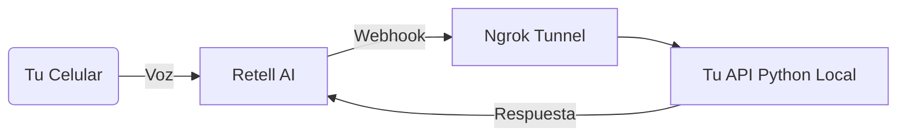

# AI Incident Commander

Un sistema de respuesta a incidentes automatizado que utiliza IA de voz para gestionar alertas críticas de infraestructura.

## Arquitectura (Fase 1)



```mermaid
sequenceDiagram
    participant User as 📱 Usuario (Teléfono)
    participant Retell as 🤖 Retell AI (Voz/TTS)
    participant Ngrok as 🚇 Ngrok (Túnel)
    participant Python as 🐍 Tu Backend (FastAPI)
    participant Groq as 🧠 Groq (Llama 3.3)

    Note over User, Retell: Fase 1: Conexión de Voz
    User->>Retell: Habla ("Hola, tengo un problema")
    Retell->>Retell: Transcribe Audio a Texto
    Retell->>Ngrok: Envía WebSocket (Texto + Eventos)
    Ngrok->>Python: Redirige al Localhost:8000

    Note over Python, Groq: Fase 2: Inteligencia
    Python->>Groq: Envía Prompt + Texto Usuario
    Groq-->>Python: Stream de Respuesta (Token por Token)
    
    loop Streaming en Tiempo Real
        Python-->>Ngrok: Envía fragmento de texto
        Ngrok-->>Retell: Pasa fragmento
        Retell-->>User: Convierte Texto a Audio y reproduce
    end