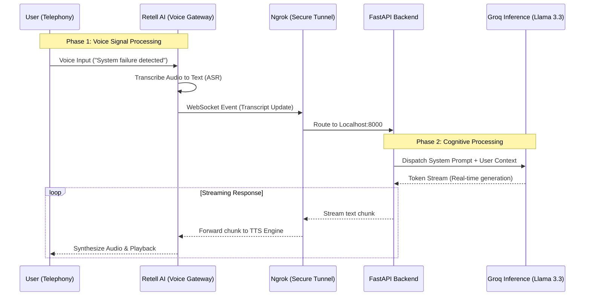

# AI Incident Commander

An automated incident response system leveraging real-time voice AI to manage critical infrastructure alerts. This project implements a full-duplex conversational agent capable of processing natural language via telephony, diagnosing reported issues, and providing context-aware technical support with sub-second latency.

## Project Overview

AI Incident Commander bridges the gap between traditional IT Ops dashboards and immediate human interaction. By integrating Retell AI's telephony gateway with Groq's high-speed inference engine, the system delivers conversational responsiveness indistinguishable from human-level latency.

### Key Features

- Real-Time Voice Processing: Speech-to-Text (STT) and Text-to-Speech (TTS) handled via Retell AI.
- Low-Latency Inference: Powered by Groq LPU (Language Processing Unit) running Llama 3.3.
- WebSocket Streaming: Bi-directional WebSocket server using FastAPI for async audio + token streaming.
- Dynamic Routing: Handles unique call sessions through dynamically generated endpoints.

## System Architecture
The system follows an event-driven architecture optimized for high throughput and minimal latency.



### Technology Stack

- Language: Python 3.10+
- Web Framework: FastAPI (Uvicorn)
- AI / LLM: Groq API -- Model: llama-3.3-70b-versatile
- Voice & Telephony: Retell AI (WebSocket integration)
- Tunneling: Ngrok (development exposure)
- Environment Management: python-dotenv

## Installation and Setup
### Prerequisites

- Python 3.10 or higher
- Ngrok account + CLI installed
- Groq API Key
- Retell AI API Key

### Local Deployment

1. Clone the repository:
```bash
git clone https://github.com/your-repo/ai-incident-commander.git
cd ai-incident-commander
```

2. Create and Activate Virtual Environment
```bash
python -m venv .venv

# Windows
.venv\Scripts\activate

# Linux / macOS
source .venv/bin/activate
```

3. Install Dependencies
```bash
pip install -r requirements.txt
```

4. Environment Configuration
Create a .env file in the project root:
```bash
GROQ_API_KEY=your_groq_api_key_here
RETELL_API_KEY=your_retell_api_key_here
```

5. Run the Server
```bash
uvicorn src.main:app --reload --host 0.0.0.0 --port 8000
```

6. Expose Localhost with Ngrok
In a separate terminal:
```bash
ngrok http 8000
``` 

## Roadmap
### Phase 1: Core Infrastructure
- FastAPI + Retell AI + Ngrok

### Phase 2: LLM Integration
- Groq Llama 3.3 with streaming responses

### Phase 3: Tool Use
- Jira ticket creation
- Server restart / remediation commands

### Phase 4: Persistence & Analytics
- Call logging
- Incident analytics database

### Live System Logs
*(Snapshot of real-time WebSocket communication and LLM Inference)*

